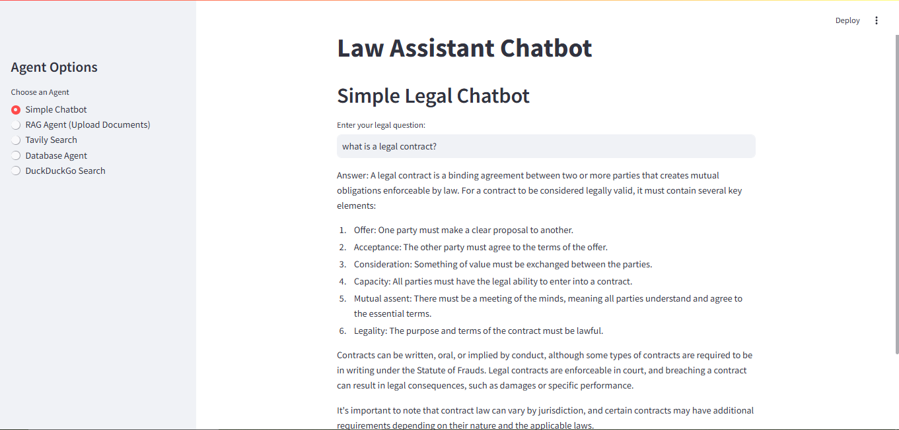

# Law Assistant Chatbot

This project is a **Law Assistant Chatbot** designed to assist users with legal queries. Built with **LangChain** and **Streamlit**, the chatbot integrates multiple intelligent agents to provide comprehensive legal assistance through document-based retrieval, keyword searches, and conversational AI.



## Features

### 1. **Simple Legal Chatbot**
Uses the Claude model from Anthropic to answer general legal questions.

### 2. **RAG Tool (Document-based Q&A)**
Leverages FAISS and HuggingFace embeddings for retrieving information from uploaded legal documents.

### 3. **Tavily Search Agent**
Performs focused searches using Tavily API and returns relevant legal content with sources.

### 4. **Database Agent**
Queries an SQLite database of legal articles for specific keyword-based searches.

### 5. **DuckDuckGo Search Agent**
Uses the DuckDuckGo search engine to provide additional legal information and sources.

## Key Technologies
- **LangChain:** Framework for building language model-powered applications.
- **Streamlit:** Frontend for interactive and user-friendly interfaces.
- **Anthropic Claude:** Advanced LLM for conversational AI.
- **FAISS:** Vector search for document retrieval.
- **SQLite:** Database for storing and querying legal articles.

## Installation

### Prerequisites
Ensure the following are installed:
- Python 3.8+
- Pip

### Setup
1. Clone the repository:
   ```bash
   git clone https://github.com/MahnoorMali-k/LawAssistant.git
   cd LawAssistant
   ```
2. Install the required dependencies:
   ```bash
   pip install -r requirements.txt
   ```
3. Set environment variables for API keys:
   ```bash
   export ANTHROPIC_API_KEY="your_anthropic_api_key"
   export TAVILY_API_KEY="your_tavily_api_key"
   ```

4. Run the Streamlit app:
   ```bash
   streamlit run app.py
   ```

## How to Use

### Tool Selection
- Select the desired agent from the sidebar:
  - **Simple Chatbot:** General legal questions.
  - **RAG Agent:** Upload documents and ask document-specific legal questions.
  - **Tavily Search:** Perform keyword-based searches with source links.
  - **Database Agent:** Retrieve articles from the database based on keywords.
  - **DuckDuckGo Search:** Legal-related web searches with source links.

### Query Input
- Input your legal query or upload documents as required.
- Receive detailed responses and links to additional resources.

## API Documentation Links
- [Tavily API Documentation](https://python.langchain.com/docs/integrations/tools/tavily_search/)
- [DuckDuckGo LangChain Integration](https://python.langchain.com/docs/integrations/tools/ddg/)

## Project Structure
```
├── database/                # Contains database files for storing chatbot data
├── output/                  # Contains output screenshots
├── src/                     # Contains Python scripts
│   ├── Law_Assistant.py     # Script for a chatbot
│   └── database_creation.py  # Script for initializing and creating the database
├── requirements.txt         # Lists all the dependencies required to run the project

```

## Future Enhancements
- Add support for multi-language queries.
- Expand database content with more legal articles.
- Integrate user authentication for personalized experience.

## License
This project is licensed under the MIT License. See the LICENSE file for details.

## Contributions
Contributions are welcome! Feel free to fork the repository and submit a pull request.

---

